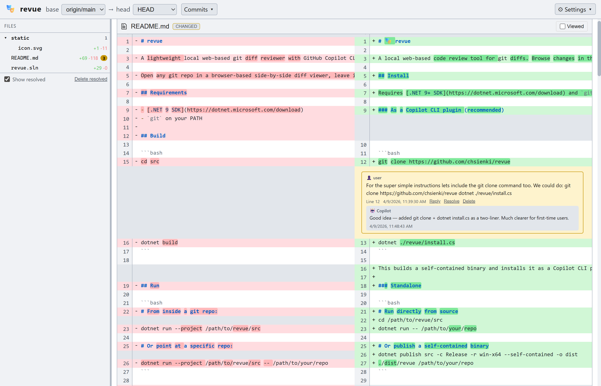

# 🎭 revue

A local web-based code review tool for git diffs. Browse changes in the browser, leave inline comments, then ask [GitHub Copilot CLI](https://docs.github.com/copilot/concepts/agents/about-copilot-cli) to address them.



## Install

Requires [.NET 9+ SDK](https://dotnet.microsoft.com/download) and `git` on your PATH.

### As a Copilot CLI plugin (recommended)

```bash
git clone https://github.com/chsienki/revue
dotnet ./revue/install.cs
```

This builds a self-contained binary and installs it as a Copilot CLI plugin with the `revue` skill. Restart Copilot CLI to pick it up.

### Standalone

```bash
# Run directly from source
cd /path/to/revue/src
dotnet run -- /path/to/your/repo

# Or publish a self-contained binary
dotnet publish src -c Release -r win-x64 --self-contained -o dist
./dist/revue /path/to/your/repo
```

revue auto-detects a free port starting at 7878 and opens your browser.

## Usage

### Reviewing diffs

1. **Select a range** — Use the `base` and `head` dropdowns to pick your diff range. Defaults to `upstream/main → HEAD`.

2. **Browse files** — The left panel shows a collapsible file tree. Click a file to scroll to its diff.

3. **Select commits** — Click "Commits ▾" to see all commits in range. Click a commit to view just that commit's changes. Shift-click to select a range.

4. **Expand context** — Click the `↑`/`↕`/`↓` arrows in the line number gutter to load more context around each hunk.

5. **Switch layouts** — In Settings, choose Side-by-side or Inline. Side-by-side mode automatically renders pure add/delete files inline (no empty panel).

### Leaving comments

1. **Click any line number** in the diff to open a comment box.

2. **Save** to post your comment. It appears as a highlighted thread inline in the diff.

3. **Reply** to any comment by clicking the Reply button — supports threaded conversations.

4. **Resolve** comments when addressed, or **Delete** them.

5. **Manage resolved** — Toggle "Show resolved" to hide/show resolved comments. Use "Delete resolved" to bulk-remove them.

6. **Orphaned comments** — Comments on lines no longer visible in the diff (e.g., after staging changes) appear in an "Other comments" section at the end.

### Copilot integration

After leaving comments, open a Copilot CLI session in your repo and say:

```
review my revue comments
```

Copilot reads your unresolved comments and responds to each one — answering questions, addressing concerns, and suggesting fixes. Copilot's replies appear as threaded responses (🤖) in the revue UI.

You can also say `launch revue` from Copilot CLI to start the server without leaving the terminal.

## Comments

Comments are stored in `.revue/comments.json` at the repo root. This file is automatically added to `.git/info/exclude` (local-only, never committed).

Each comment tracks:
- **File, line, and side** (left/old or right/new)
- **Author** (`user` or `copilot`)
- **Threaded replies** with their own authors
- **Resolved status**

## Settings

- **Theme** — Auto (system) / Dark / Light
- **Ignore whitespace** — Strips whitespace-only changes
- **Diff layout** — Side-by-side or Inline

All preferences persist via cookies.

## Project structure

```
revue/
├── src/
│   ├── Program.cs          # ASP.NET Core minimal API + all endpoints
│   ├── GitHelper.cs        # Git CLI wrapper + diff parser
│   ├── CommentsStore.cs    # .revue/comments.json read/write
│   └── Models.cs           # Comment, Reply, DiffFile records
├── static/
│   ├── index.html          # Entire frontend (HTML + CSS + JS, no build step)
│   ├── icon.svg            # App icon (🎭 emoji)
│   └── manifest.json       # Web app manifest for standalone mode
├── skill/                  # Copilot CLI plugin
│   ├── plugin.json
│   └── skills/revue/
│       └── SKILL.md
├── install.cs              # Build + install as Copilot plugin
└── .github/
    └── copilot-instructions.md
```

## API

| Method | Endpoint | Description |
|--------|----------|-------------|
| GET | `/api/config` | Default base ref + repo root |
| GET | `/api/branches` | All local + remote branches |
| GET | `/api/log?base=X&head=Y` | Git log between two refs |
| GET | `/api/diff?base=X&head=Y&ignoreWhitespace=bool` | Diff for all files (includes untracked) |
| GET | `/api/file-diff?base=X&head=Y&file=F&context=N` | Diff for a single file with configurable context |
| GET | `/api/comments` | Load all comments |
| POST | `/api/comments` | Add or update a comment |
| POST | `/api/comments/{id}/replies` | Add a reply to a comment |
| POST | `/api/comments/delete-batch` | Bulk delete by ID array |
| DELETE | `/api/comments/{id}` | Delete a single comment |
